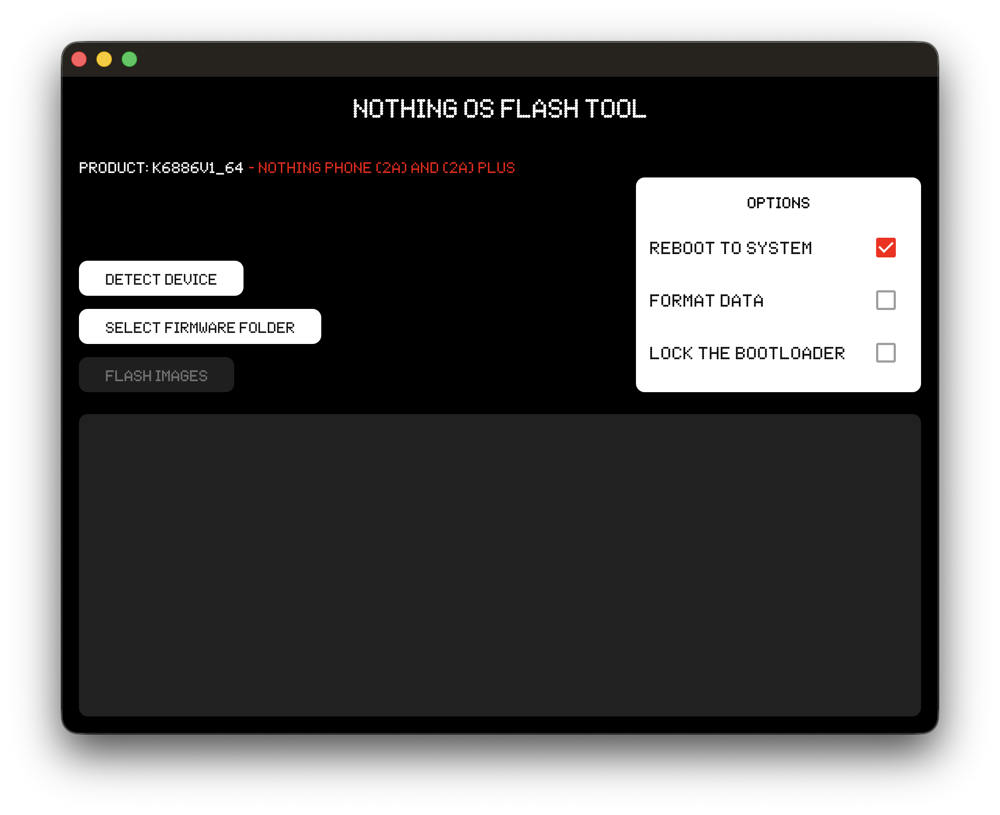

# nothingos_flasher

A cross-platform desktop GUI flash tool made with Flutter for NothingOS devices

>[!CAUTION]
> **DISCLAIMER: I AM NOT RESPONSIBLE FOR BRICKED DEVICES.
> I am not responsible for dead SD cards, thermonuclear war, or you getting fired because the alarm app failed. Please do some research if you have any concerns about features included in this tool before flashing it. YOU are choosing to make these modifications.**

## Getting Started

In order to use this tool, you'll need:

- [fastboot binary](https://developer.android.com/tools/releases/platform-tools#downloads) on your OS respective PATH
- A complete and extracted NothingOS factory image archive from [Nothing Archive](https://spike0en.github.io/nothing_archive) for your device
- And a NothingOS device with an USB cable :)

Afterwards, you can first reboot your device into bootloader mode, detect it from the GUI, select the
factory image archive directory and then press on flash images button and let the magic start.

Additionnally, you can choose if you want to reboot to system, format data or lock the bootloader as options.

Do note that this tool will only flash partitions to your current [A/B slot](https://source.android.com/docs/core/ota/virtual_ab), if you want to flash both slots, please switch to the opposite slot afterwards.

## Supported Nothing and CMF devices

Currently, all Nothing and CMF devices running NothingOS are supported by this tool:

 ### Nothing devices
 - Nothing Phone (1)
 - Nothing Phone (2)
 - Nothing Phone (2a)
 - Nothing Phone (2a) Plus
 - Nothing Phone (3)
 - Nothing Phone (3a)
 - Nothing Phone (3a) Pro
 - Nothing Phone (3a) Lite
 - Nothing Phone (4a)
 - Nothing Phone (4a) Pro

 ### CMF devices
 - CMF Phone 1
 - CMF Phone 2 Pro

## License

This project is licensed under the **GNU Affero General Public License v3.0 (AGPL-3.0)**.

Key points to be aware of:

* You are free to use, modify, and distribute the software.
* If you modify and use the software publicly, you must release your source code.
* You must retain the same license (`AGPL-3.0`) when redistributing modified versions.
* You cannot keep modifications private if the software is used to provide a networked service.

For full details, please refer to the [LICENSE](LICENSE) file.
